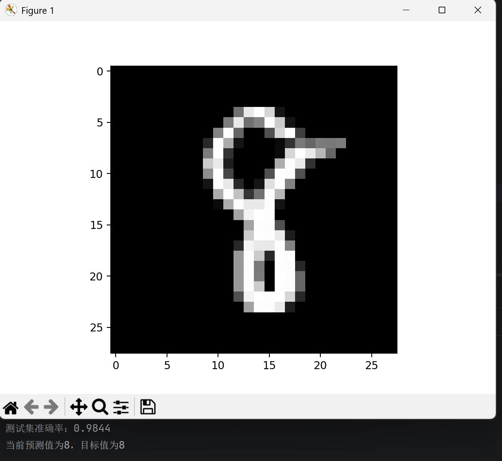
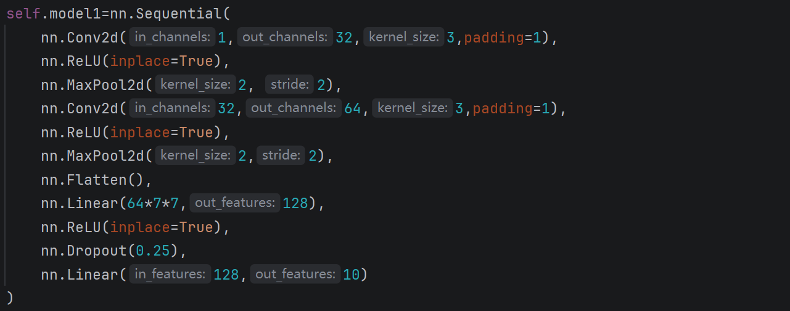
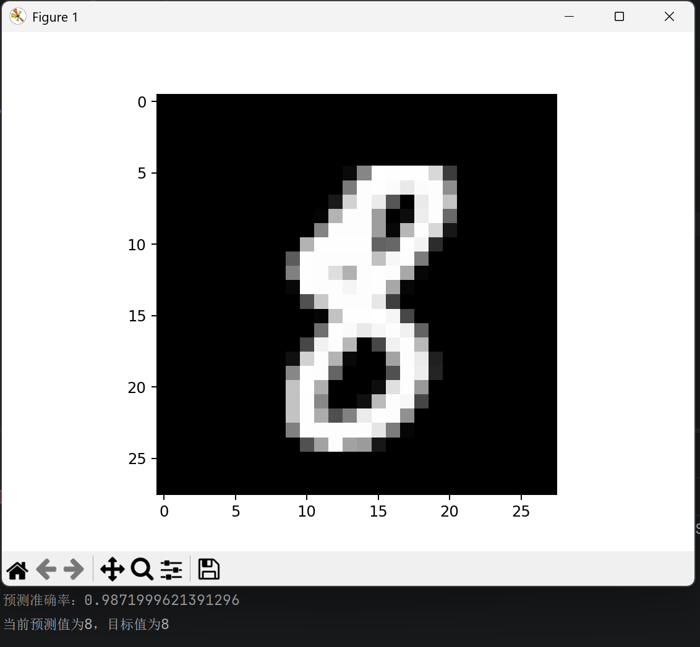

## ——————MINST分类器（SVM/CNN）——————

## ——项目简介——

         一个从零实现的分类器，采用SVM，CNN两种方式，专用于分类MNIST数据集。

### ——数据集简介——

--数据集名称：MNIST

--加载：使用torchvision.datasets.MNIST()

--类别：0-0，1-1，2-2，3-3，4-4，5-5，6-6，7-7，8-8，9-9（类别idx即类别名）

--大小：训练集54000张，验证集6000张，测试集10000张（验证集需自己划分）

## ————1、SVM————

### ——模型信息——

--方法：SVM

--参数：kernel="rbf"，C=3.0

--输入特征：HOG（方向梯度直方图）

### ——性能结果——

--准确率：98%

### ——预测示例——

## ————2、CNN————

### ——模型信息——

--方法：CNN

--结构：采用Conv+ReLU+MaxPool2d叠加两次提取特征，再采用Flatten+线性层进行特征整合和输出

### ——性能结果——

--数据增强：无

--训练轮次：10

--损失函数：CrossEntropyLoss

--优化器：Adam（lr=0.001）

--准确率：99%

### ——预测示例——

